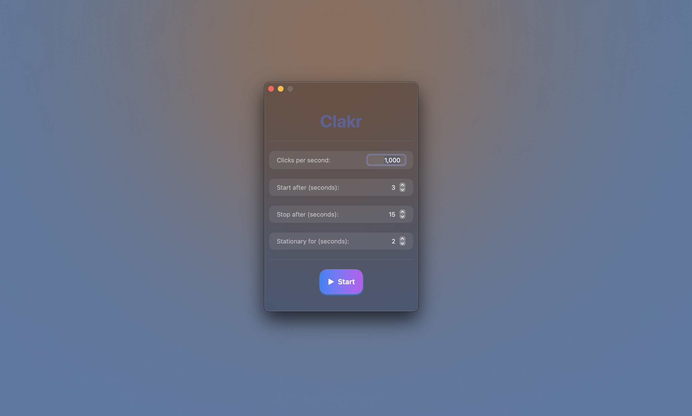

<div align="center">

# clakr



Clakr is an auto-clicker application developed in Swift, focusing on high-speed automated mouse clicking. It has undergone testing across different tasks using intervals of 15 seconds to ensure performance consistency. Please be aware that by using Clakr, you accept full responsibility for any consequences, such as bans or penalties from software or services that prohibit the use of auto-clickers.

[](LICENSE.md)
[](https://github.com/senpaihunters/clakr/releases)
[](https://github.com/senpaihunters/clakr/issues)

</div>

## Features

- **Configurable Click Rate**: Customize clicks per second.
- **Delayed Start**: Schedule the start of clicking.
- **Automatic Stop**: Set a timer to stop clicking.
- **Stationary Detection**: Clicks occur only when the mouse is still.

## Getting Started

### Prerequisites

- macOS 12 or later

### Installation

1. Download the latest version from the [Releases](https://github.com/senpaihunters/clakr/releases) page.
2. Drag the app to your Applications folder.
3. Due to the lack of a code-signing certificate, right-click and select "Open" if you encounter any warnings.

### Usage

1. Launch clakr.
2. Configure your desired settings.
3. Click "Start" to initiate auto-clicking.
4. Press "Stop" or allow the auto-stop timer to end the session.

## Performance Validation

<details>
    <summary>Click here to view results</summary>

### Steps

1. Download the script from [here](autoclicker-tests/validator/runcals.js).
2. Install `Node.js` and `jstat`:

```sh
brew install node
npm install jstat
```

3. Navigate to the script directory:

```sh
cd path/to/autoclicker-tests
```

4. Run the script:

```sh
node runcals.js
```
> Make sure you put in your test results you've gotten from Clakr into the test section, it will calculate the results and data itself

> Replace `runcals.js` with the filename if you have renamed the validator script.

### Test Summary

```sh
------------------- Clakr Test Summary ------------------------

Performance:
  Best Run: 15000 clicks
  Slowest Run: 14798 clicks
  Average: 14972.44 clicks
  Median: 14979.50 clicks
  Range: 202.00 clicks (14798 - 15000)
  Perfect Result: 15000 clicks
  Number of times Perfect Result happened: 2
  Probability of Perfect Result: 2.00%

Sample Statistics:
  Sample Size: 100 clicks
  Test Length: 15 seconds
  Clicks Per Second: 1000
  Start after: 3 seconds
  Stationary for: 2 seconds
  Sum of All Clicks: 1497244.00 clicks
  10th Percentile: 14942.00 clicks
  90th Percentile: 14991.10 clicks
  Mode: 14988,14989 clicks

Variability:
  Error Margin: 0.18%
  Standard Deviation: ±27.20
  Variance: 740.11
  Coefficient of Variation: 0.18%
  Interquartile Range (IQR): 20.00 clicks
  Standard Error of the Mean (SEM): 2.7205

Distribution Shape:
  Skewness: -3.5104
  Kurtosis: 17.0360

Confidence Intervals:
  95%: 14967.11 - 14977.77
  99%: 14965.43 - 14979.45

Outliers:
  Threshold: 3 standard deviations
  Outlier Clicks: 2
  Outlier Values: 14798, 14876.0

--------------------------------------------------------------
```

<details>
    <summary>Individual Runs</summary>

- Run 1: 14989
- Run 2: 14990
- Run 3: 14989
- Run 4: 14941
- Run 5: 14925
- Run 6: 14993
- Run 7: 14974
- Run 8: 14977
- Run 9: 14980
- Run 10: 14973
- Run 11: 14968
- Run 12: 14986
- Run 13: 14977
- Run 14: 14979
- Run 15: 14983
- Run 16: 14990
- Run 17: 14992
- Run 18: 14987
- Run 19: 14975
- Run 20: 14987
- Run 21: 14925
- Run 22: 14970
- Run 23: 14965
- Run 24: 14941
- Run 25: 14964
- Run 26: 14988
- Run 27: 14976
- Run 28: 14985
- Run 29: 14990
- Run 30: 14982
- Run 31: 14978
- Run 32: 14984
- Run 33: 14979
- Run 34: 14981
- Run 35: 14977
- Run 36: 14988
- Run 37: 14973
- Run 38: 14986
- Run 39: 14980
- Run 40: 14992
- Run 41: 14989
- Run 42: 14975
- Run 43: 14987
- Run 44: 14978
- Run 45: 14983
- Run 46: 14991
- Run 47: 14976
- Run 48: 14985
- Run 49: 14974
- Run 50: 14988

</details>

### Factors Affecting Performance

Several technical aspects can influence the click count:

1. **Timer Granularity**
2. **Event Coalescing**
3. **System Load**
4. **Thread Scheduling**
5. **API and Driver Overhead**
6. **Hardware Limitations**
7. **Software Limitations**
8. **Precision of Floating-Point Arithmetic**
9. **Interrupts and Context Switching**
10. **Event Processing**

</details>

## Contributing

We welcome contributions! Please feel free to submit pull requests or create issues for any bugs or enhancements.

## Support

If you need help or want to discuss clakr, check out our [Issues](https://github.com/senpaihunters/clakr/issues) page.

## License

clakr is open-sourced under the MIT License. See the [LICENSE](LICENSE.md) file for more details.

## Explore More

- [Autoclicking Test Site](https://clakr-delta.vercel.app/)
- [Validator Source Code](autoclicker-tests/website/index.html)

---

© 2024 clakr. All rights reserved. Available exclusively for macOS.